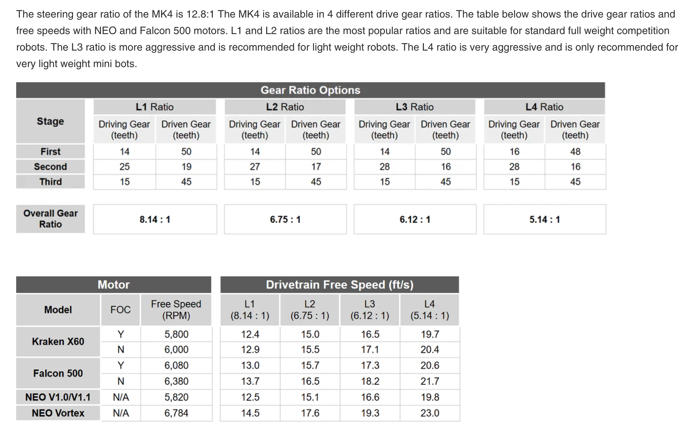
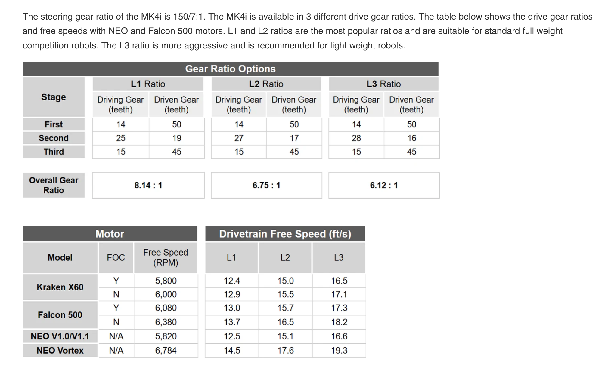
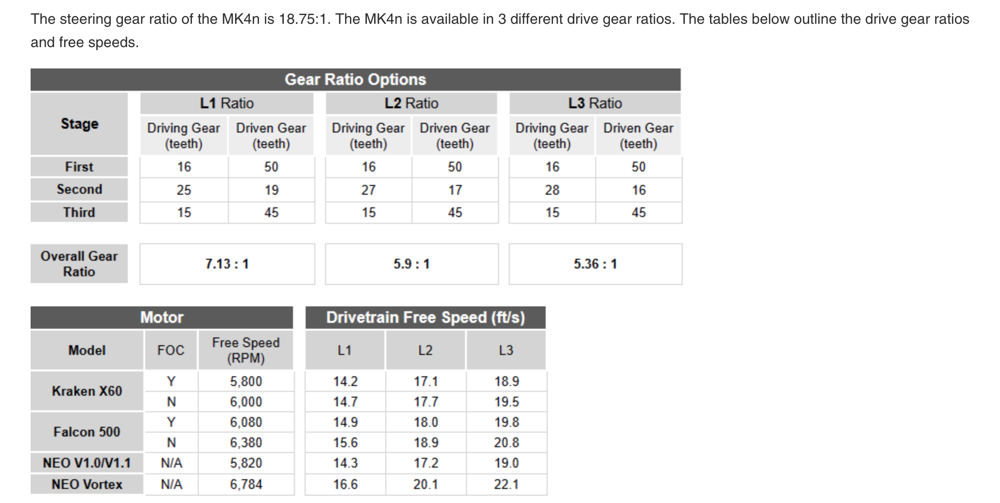
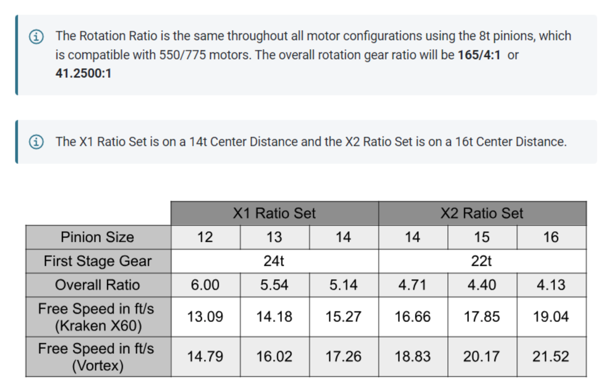
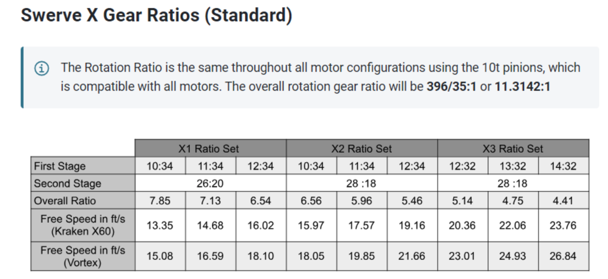
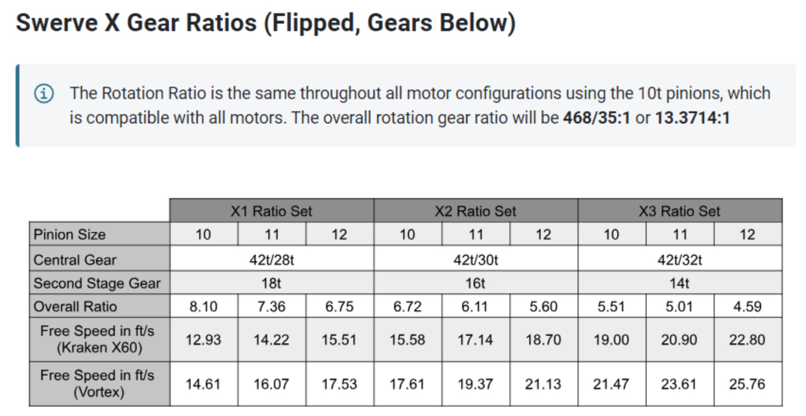

# Swerve Module COTS Types  

**SDS**
----
- [x] MK4

- [x] MK4i

- [x] MK4i w/ Upgrade

- [x] MK4n

**REV**
----
- [ ] Max Swerve

- [ ] Max Swerve Upgraded

**WCP**
----
- [ ] Swerve XS

- [ ] Swerve X

- [ ] Swerve X Flipped
