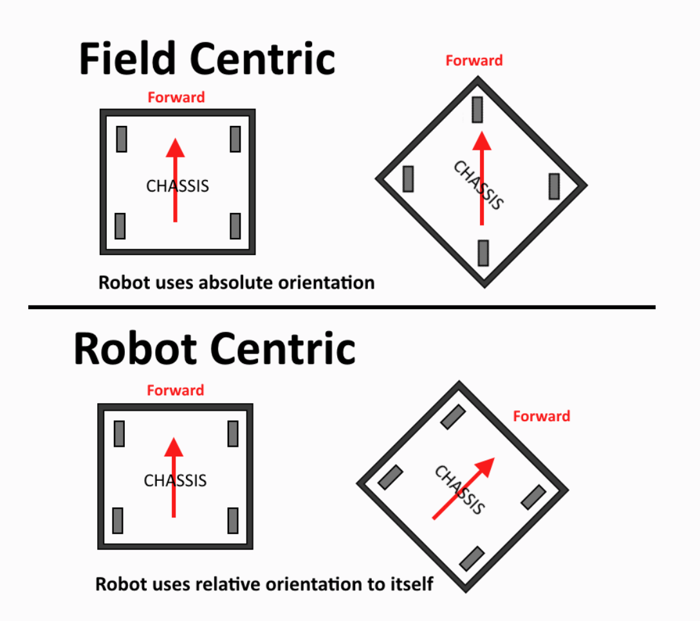
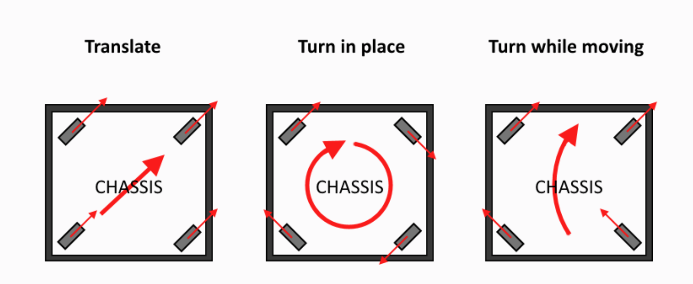
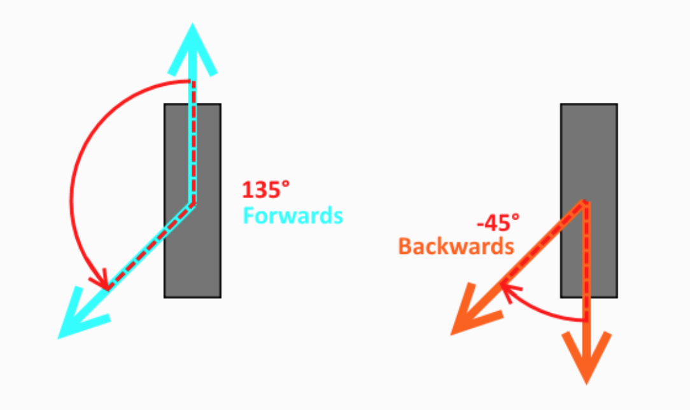

# Swerve README
Hello, this is what I'm calling the "Base Swerve", this is made based on 364's code, but I have added many features, including 2nd Order Swerve Kinematics. </br>

# BaseSwerve </br>
**Project Goals**
----
- [x] CANivore Support
- [x] Pigeon2 support. </br>
- [x] Simple 2nd Order Swerve Kinematics.</br>
- [x] Falon500 Support </br>
- [x] KrakenX60 Support </br>
- [x] Phoenix 6 API Integration. </br>

**Basic Swerve Code for a Swerve Module using Falcon/Kraken Motors, a CTRE CANCoder, and a CTRE Pigeon2 Gyro** </br>
This code was designed with Swerve Drive Specialties MK3, MK4, and MK4i style modules in mind, but should be easily adaptable to other styles of modules.</br>

**Using the Swerve library**
----
The following things must be adjusted to your robot and module's specific constants in the Constants.java file (all distance units must be in meters, and rotation units in radians):</br>


**Setting Constants For Swerve**
----
The following things must be adjusted to your robot and module's specific constants in the Constants.java file (all distance units must be in meters, and rotation units in radians):</br>
These instructions are mostly followable from Step 
1. Gyro Settings: ```pigeonID``` and ```invertGyro``` (ensure that the gyro rotation is CCW+ (Counter Clockwise Positive), manually rotate robot CCW and ensure yaw rotation values increase positively.
2. ```chosenModule```: 
<br>If you are using a COTS SDS Module (more modules will be added in the future), set the module and drive ratio you are using here. 
<br>This will automatically set certain constants for the specific module required to function properly. 
<br> Here is a list of the constants that will automatically be set if you are using a supported modules:
    * Wheel Circumference
    * Angle Motor Invert
    * Drive Motor Invert
    * CANCoder Sensor Invert
    * Angle Motor Gear Ratio
    * Drive Motor Gear Ratio
    * Angle Falcon Motor PID Values
    
3. ```trackWidth```: Center to Center distance of left and right modules in meters.
4. ```wheelBase```: Center to Center distance of front and rear module wheels in meters.
5. ```wheelCircumference```: Cirumference of the wheel (including tread) in meters. <br><b>If you are using a supported module, this value will be automatically set.</b>
6. ```driveGearRatio```: Total gear ratio for the drive motor. <br><b>If you are using a supported module, this value will be automatically set.</b>
7. ```angleGearRatio```: Total gear ratio for the angle motor. <br><b>If you are using a supported module, this value will be automatically set.</b>
8. ```canCoderInvert``` and ```angleMotorInvert```: Both must be set such that they are CCW+. <br><b>If you are using a supported module, this value will be automatically set.</b>
9. ```driveMotorInvert```: <b>If you are using a supported module, this value will be automatically set.</b>
<br>This can always remain false, since you set your offsets in step 11 such that a positive input to the drive motor will cause the robot to drive forwards.
<br>However this can be set to true if for some reason you prefer the bevel gears on the wheel to face one direction or another when setting offsets. See Step 11 for more information.

10. ```Module Specific Constants```: set the Can Id's of the motors and CANCoders for the respective modules, see the next step for setting offsets.
11. Setting Offsets
    * For finding the offsets, use a piece of wood that is straight against left front/back , and  right front/back modules , face the same direction and ensure that the modules are straight as possible. 
    * Point the bevel gears of all the wheels in the same direction (either facing left or right), where a postive input to the drive motor drives the robot forward (you can use phoenix tuner to test this). If for some reason you set the offsets with the wheels backwards, you can change the ```driveMotorInvert``` value to fix.
    * Open smartdashboard (or shuffleboard and go to the smartdashboard tab), you will see 4 printouts called "Mod 0 Cancoder", "Mod 1 Cancoder", etc. 
    <br>If you have already straightened the modules, copy those 4 numbers exactly (to 3 decimal places) to their respective ```angleOffset``` variable in constants.
    <br><b>Note:</b> The CANcoder values printed to smartdashboard are in degrees, when copying the values to ```angleOffset``` you must use ```Rotation2d.fromRotations("copied value")```.

12. Angle Motor PID Values: <br><b>If you are using a supported module, this value will be automatically set. If you are not, or prefer a more or less aggressive response, you can use the below instructions to tune.</b> 
    * To tune start with a low P value (0.01).
    * Multiply by 10 until the module starts oscilating around the set point
    * Scale back by searching for the value (for example, if it starts oscillating at a P of 10, then try (10 -> 5 -> 7.5 -> etc)) until the module doesn't oscillate around the setpoint.
    * If there is any overshoot you can add in some D by repeating the same process, leave at 0 if not. Always leave I at 0.

13. ```maxSpeed```: In Meters Per Second. ```maxAngularVelocity```: In Radians Per Second. For these you can use the theoretical values, but it is better to physically drive the robot and find the actual max values.


14. Get the drive characterization values (KS, KV, KA) by using the WPILib characterization tool, found [here](https://docs.wpilib.org/en/stable/docs/software/wpilib-tools/robot-characterization/introduction.html). You will need to lock your modules straight forward, and complete the characterization as if it was a standard tank drive.
15. ```driveKP```: 
<br>After completeing characterization and inserting the KS, KV, and KA values into the code, tune the drive motor kP until it doesn't overshoot and doesnt oscilate around a target velocity.
<br>Leave ```driveKI```, ```driveKD```, and ```driveKF``` at 0.0.


**Controller Mappings**
----
This code is natively setup to use a xbox controller to control the swerve drive. </br>
* Left Stick: Translation Control (forwards and sideways movement)
* Right Stick: Rotation Control </br>
* Y button: Zero Gyro (useful if the gyro drifts mid match, just rotate the robot forwards, and press Y to rezero)
* B button: Resets Modules to forward.
* Left Bumper: Switches To Robot Centric Control while held

**Drive Modes**
----
There are two main operation modes for swerve drive, field centric and robot centric.



There are a few ways that the robot can move based on the drivers input and how the wheels are turning. We will still need to implement "turn while moving".




**Simple Module Optimization**
----
Optimization has been implemented.



**Simple 2nd Order Swerve Kinematics**
----
Unfortunately, the first order kinematics are limited in the way that they do not solve
for the modules’ linear accelerations and angular velocities that may be needed to per-
form a maneuver. With a traditional tank drive, making a constant maneuver (e.g. drive
straight while turning with constant linear and angular velocities) only requires constant
wheel velocities, so the desired path trajectory can be achieved only using first order
kinematics. In contrast, consider a swerve drive that is driving straight while turning
with constant velocities - while the overall robot has constant velocities, each individual
module’s linear velocity and heading are constantly changing. This means that in practice, a swerve drive performing this maneuver using the first order kinematics will skew
in the direction of rotation.

So to fix the skew this implements 254's solution.

This is in your Drivetrain Subsystem, it takes your chassis speed, and corrects it to eliminate skew.
```java
private static ChassisSpeeds correctForDynamics(ChassisSpeeds originalSpeeds) {
        final double LOOP_TIME_S = 0.02;
        Pose2d futureRobotPose =
            new Pose2d(
                originalSpeeds.vxMetersPerSecond * LOOP_TIME_S,
                originalSpeeds.vyMetersPerSecond * LOOP_TIME_S,
                Rotation2d.fromRadians(originalSpeeds.omegaRadiansPerSecond * LOOP_TIME_S));
        Twist2d twistForPose = GeometryUtils.log(futureRobotPose);
        ChassisSpeeds updatedSpeeds =
            new ChassisSpeeds(
                twistForPose.dx / LOOP_TIME_S,
                twistForPose.dy / LOOP_TIME_S,
                twistForPose.dtheta / LOOP_TIME_S);
        return updatedSpeeds;
    }
```
______
This is a custom shim of the WPILib Pose2d class, correctForDynamics uses the log function to calculates the logarithm of a Pose2d object by extracting the rotation angle, performing some calculations based on the rotation angle, and rotating the translation part of the Pose2d object. The resulting translation and rotation components are then used to create a Twist2d object, which is returned as the result.
```java
package frc.robot.utils;

import edu.wpi.first.math.geometry.Pose2d;
import edu.wpi.first.math.geometry.Rotation2d;
import edu.wpi.first.math.geometry.Translation2d;
import edu.wpi.first.math.geometry.Twist2d;

public class GeometryUtils {
      /** A small constant value for numerical stability. */
    private static final double kEps = 1E-9;

    /**
     * Calculates the exponential of a twist, yielding a new pose.
     *
     * @param delta The twist to compute the exponential of.
     * @return The resulting pose after applying the twist.
     */
    public static Pose2d exp(final Twist2d delta) {
        double sinTheta = Math.sin(delta.dtheta);
        double cosTheta = Math.cos(delta.dtheta);
        double s = calculateS(delta.dtheta, sinTheta);
        double c = calculateC(delta.dtheta, cosTheta);
        return new Pose2d(
                new Translation2d(delta.dx * s - delta.dy * c, delta.dx * c + delta.dy * s),
                new Rotation2d(cosTheta, sinTheta));
    }

    /**
     * Calculates the value of 's' used in the exponential calculation.
     *
     * @param dtheta The delta theta value.
     * @param sinTheta The sine of delta theta.
     * @return The 's' value.
     */
    private static double calculateS(double dtheta, double sinTheta) {
        return Math.abs(dtheta) < kEps ? 1.0 - 1.0 / 6.0 * dtheta * dtheta : sinTheta / dtheta;
    }

    /**
     * Calculates the value of 'c' used in the exponential calculation.
     *
     * @param dtheta The delta theta value.
     * @param cosTheta The cosine of delta theta.
     * @return The 'c' value.
     */
    private static double calculateC(double dtheta, double cosTheta) {
        return Math.abs(dtheta) < kEps ? .5 * dtheta : (1.0 - cosTheta) / dtheta;
    }

    public static Twist2d log(final Pose2d transform) {
      final double dtheta = transform.getRotation().getRadians();
      final double half_dtheta = 0.5 * dtheta;
      final double cos_minus_one = Math.cos(transform.getRotation().getRadians()) - 1.0;
      double halftheta_by_tan_of_halfdtheta;
      if (Math.abs(cos_minus_one) < kEps) {
        halftheta_by_tan_of_halfdtheta = 1.0 - 1.0 / 12.0 * dtheta * dtheta;
      } else {
        halftheta_by_tan_of_halfdtheta =
            -(half_dtheta * Math.sin(transform.getRotation().getRadians())) / cos_minus_one;
      }
      final Translation2d translation_part =
          transform
              .getTranslation()
              .rotateBy(new Rotation2d(halftheta_by_tan_of_halfdtheta, -half_dtheta));
      return new Twist2d(translation_part.getX(), translation_part.getY(), dtheta);
    }
}
```
To show the difference in First Order (regular) Kinematics, and Second Order, Rafi Alum From 449 in the same post, provided these gifs for comparison. </br>


# COTS Module Documentation

* [Modules](Modules.md): by vendor